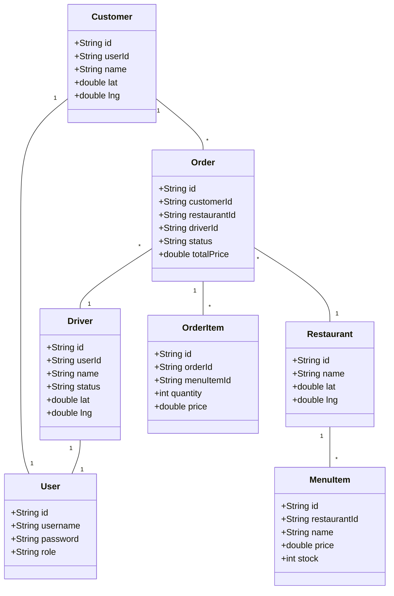

# T1-T2: Phân tích, Thiết kế & Data Generator (Food Delivery)

Dựa trên yêu cầu của T1-T2, dự án **Food Delivery Network Simulation** sẽ được thiết kế từ con số 0 với trọng tâm là xử lý File CSV và chuẩn bị dữ liệu lớn để test Đa luồng (Concurrency).

## User Review Required
> [!IMPORTANT]
> - Cấu trúc 8 file CSV đã bao quát đủ các Entity chưa? (Gồm: users, customers, drivers, restaurants, menu_items, orders, order_items, dispatcher_logs).
> - Bạn có muốn dùng thư viện bên ngoài (như Faker) để sinh dữ liệu cho `DataGenerator.java` hay chỉ dùng thư viện chuẩn `java.util.Random` để project nhẹ nhất có thể?

## 1. Phân tích Bài toán & Luồng nghiệp vụ
Dự án tập trung xử lý 3 Race Condition chính khi nhiều luồng (Thread) truy xuất đồng thời vào các file CSV:
1. **Double Assignment (Lỗi điều phối):** 2 Thread cùng đọc `orders.csv` và thấy 1 Order đang "PENDING", sau đó cả 2 cùng gán Order đó cho 2 Driver khác nhau.
2. **Oversell MenuItem (Lỗi âm kho):** 2 Thread (Customer) cùng mua món A. Cả 2 cùng đọc `menu_items.csv` thấy kho còn 1. Cả 2 cùng trừ kho thành công dẫn đến tồn kho bị âm (-1).
3. **Driver Overload (Lỗi quá tải tài xế):** 1 Driver đang rảnh. 2 Thread điều phối cùng thấy Driver rảnh nên gán 2 Order khác nhau cho cùng 1 Driver tại cùng một thời điểm.

## 2. Thiết kế Sơ đồ (Diagrams)

### Use Case Diagram
```mermaid
usecaseDiagram
    actor Customer
    actor Driver
    actor Restaurant
    actor DispatcherSystem

    Customer --> (Browse Menu)
    Customer --> (Place Order)
    Customer --> (Track Order)

    Driver --> (Update Status)
    Driver --> (Accept/Deliver Order)

    Restaurant --> (Manage Menu)
    Restaurant --> (Update Stock)

    DispatcherSystem --> (Find Nearest Driver)
    DispatcherSystem --> (Assign Order to Driver)
```

### Class Diagram (Core Entities)


## 3. Thiết kế Schema 8 File CSV

1. **`users.csv`**: `id,username,password,role`
2. **`customers.csv`**: `id,user_id,name,phone,latitude,longitude`
3. **`drivers.csv`**: `id,user_id,name,status,latitude,longitude` (status: AVAILABLE, DELIVERING, OFFLINE)
4. **`restaurants.csv`**: `id,name,address,latitude,longitude`
5. **`menu_items.csv`**: `id,restaurant_id,name,price,stock`
6. **`orders.csv`**: `id,customer_id,restaurant_id,driver_id,status,total_price,created_at` (status: PENDING, ASSIGNED, DELIVERED, CANCELLED)
7. **`order_items.csv`**: `id,order_id,menu_item_id,quantity,price`
8. **`dispatcher_logs.csv`**: `log_id,order_id,driver_id,action,timestamp`

## 4. Proposed Changes (Kế hoạch Code)
Chúng ta sẽ tạo một thư mục mới `C:\Users\daomi\.gemini\antigravity\scratch\food_delivery` và setup project Java tại đây.

### [NEW] `src/com/fooddelivery/generator/DataGenerator.java`
Sẽ viết một script Java (Core Java, không cần Framework) thực hiện:
- Sinh ngẫu nhiên dữ liệu khách hàng, nhà hàng, tài xế (toạ độ lat/lng giả lập).
- Sinh ngẫu nhiên Menu Item cho từng nhà hàng.
- Sinh thuật toán tạo `>= 5,000` Orders và `>= 9,000` OrderItems (Tổng các file sẽ vượt `18,000` dòng).
- Ghi tuần tự ra 8 file CSV vào thư mục `data/`.
- Test chức năng Serialize (Ghi ra file) và Parse (Đọc lại từ file xem có lỗi không).

## 5. Verification Plan
- Chạy file `DataGenerator.java`.
- Kiểm tra dung lượng và số dòng của thư mục `data/*.csv`.
- Đảm bảo `order_items.csv` có ít nhất 9,000 dòng và tổng số dòng của 8 file vượt mức 18,000 dòng như yêu cầu.
